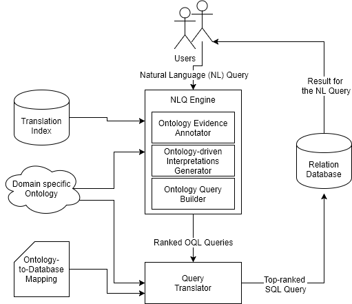
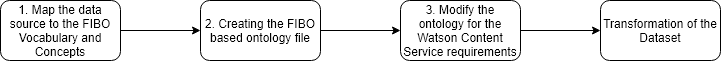

Introduction
=====================
Natural Language Querying is rapidly becoming a powerful way to interact and gain useful insights from data in a variety of different domains. It enables users to form queries intuitively and reason about the same in natural language using entities and concepts that are relevant to the domain. Each industry has its specific terminology to ask questions on the data. The high-level goal of the project is to demonstrate how financial experts can use the capabilities of Natural Language Querying (NLQ) interfaces on financial warehouse data. For these purposes, the current application stack requires an ontology, which represents the domain knowledge and the financial terms. The financial industry business ontology (FIBO) is a standard ontology for the financial domain, which can serve this purpose. This ontology provides adaptable concepts and relations based on financial terms. The goal of this paper is to evaluate how FIBO can be adapted to a given data set so that current application stack is using a standard ontology for the financial warehouse data.
The usage of a standard business ontology has several advantages for NLQ interfaces. Since the ontology is standardized, it contains the exact domain specific meaning for the financial terms. The standardization enables a precise querying of the data and common understanding for the language of financial experts.
A standard ontology also allows comparison of the data from multiple sources and provides a consolidated view over different data repositories. Because of the higher data consistency and better data integration, the standard improves business process automation and efficient risk analysis or reporting.
The paper will address the essential steps to map an existing dataset to  FIBO and to transform it for the NLQ application. The steps include (1) identification of a relevant FIBO-Ontology subset for the data, (2) the creation of an ontology mapping and (3) transforming the given dataset to conform to the target schema represented by the selected subset of FIBO.
The first chapter explains the current solution and will outline the basic concepts of the existing NLQ tool and the basics of ontologies. Based on that, the paper will describe the necessary ontology technologies and provide a overview about FIBO in detail.
The chapter will provide a self-contained introduction to description logics, the Web Ontology Language, and the Resource Description Framework. The report provides a brief description of the salient aspects of FIBO. For a detailed description, the reader is referred to the FIBO documents available here [@EDMCouncil.2017f] [@EDMCouncil.2017g]. The central part of this writing will focus on the workflow to enable natural language querying on financial data by using FIBO. This part will go into detail about the evaluation of datasets for FIBO, the process of the ontology development, the transformation of the domain schema for the application and testing of the developed mappings and transformations.
This paper describes an application based on an ontology-driven system for natural language querying over relational data stores, as described in Saha et al. [@Saha.2016] and will refer to this paper. The ontology technologies used by this application are standardizes by the World Wide Web Consortium (W3C). This document will explain the basics based on these standards. All further information about the financial ontology will refer to the internal documentation of the EDM Council and the Object Management Group (OMG) [^1] documentation for FIBO.
This paper purposes that every financial dataset can be mapped to the financial industry business ontology and then integrated in the described application environment. Therefore this document will present a workflow that has been iterated and tested over several datasets. The paper will explain the fundamentals of the FIBO ontology and how the domain specific ontology has been created. As a result, this report will have integrated FIBO in the current NLQ application and will discuss the applied approach.

Natural Language Querying Application {#sec:NLQ}
=====================
This chapter provides a background on ontology-driven Natural Language Querying (NLQ) application that enables users to query and analyze data stored in a relational database. The application is based on the Athena NLQ System [@Saha.2016] developed in 2016 by Saha et al.
The system uses a two-stage processing of the natural language input. In the first step, the NLQ request is translated into an intermediate language called Ontology Query Language (OQL). In the second stage, the OQL query will be translated into a SQL query over the relational database.
This chapter will explain the main components and requirements of the application. It focuses on the interaction of the components and will not discuss the underlying algorithms if not necessary for the integration of the FIBO ontology family.

{#fig:NLQ caption="Natural Language Querying Application Architecture" width=80%}

As shown in [@fig:NLQ] the Natural Language Querying System contains three main components. The Natural Language Querying Engine provides the NLQ interface for the user and sends ranked OQL queries to the query translator. The query translator transforms the OQL Queries to SQL queries and interacts with the relational store. The relational store holds all data in a relational schema, that conforms to the ontology. The NLQ Engine has three main components.
The **Ontology Evidence Annotator** analyses the plain input NLQ text. Moreover, the annotator produces a set of *Relationships Constraints RC* and a *Evidence Set E*. Each element of the Evidence Set is part of either the meta data evidence or the data value evidence, based on the annotation algorithm. For each token, when not excluded from the analysis, is going to be mapped to at least one element in the set of ontology elements, by one of the annotation algorithms.
The **Metadata Evidence Annotator** looks up synonyms for the token in the ontology elements, based on a dictionary.
The **Data Value Evidence Annotator** tries to match the word to one or more ontology properties. The evidence set is then used by the Ontology-driven Interpretations Generator to generate a *selected set(SS)*. The chosen set contains all possible query interpretations for the evidence set. Each interpretation has a set of interpretation tree, which are evaluated by an ontology-driven Interpretation Algorithm. The result is a ranked list of interpretations. These are transformed into an OQL query by the ontology query builder.
The OQL queries are the input to the query translator. A translation algorithm transforms the OQL query in a SQL query by using the ontology-to-database mapping.


Basic Concepts of Ontologies
=====================
The Definition of an Ontology
------------------------------
In the field of computer science the common understanding of an ontology is based on the definition of Tom Grubber in the context of knowledge sharing [@Blumauer.2006, side 12]:
An ontology is a formal, explicit specification of a shared conceptualization (1993 Gruber) [@Gruber.1993]. The ontology is a formal model to describe a knowledge domain [@Hesse.2002] [@Gruber.1993] by using a standardized vocabulary. This vocabulary is usually defined by a taxonomy [@Hesse.2002]. In this context, a taxonomy means a hierarchically structured set of terms in a controlled vocabulary [@Garshol.2004]. The taxonomy of an ontology contains different modeling primitives based on the ontology language [@ReinoutvanRees.2003]. In most cases, these are classes, relations, functions, and axioms. This paper will focus on the concepts of the Web Ontology Language (OWL), which is used by FIBO.
Ontologies are used in several contexts and technologies. Each ontology must be represented in a particular format to be readable by humans or systems. This specification is called ontology language [@Guarino.1998]. To reduce development efforts ontologies are represented in commonly understandable ways. For this reason, their representation relies on a standardized ontology language.

Description Logic
-------------------------------------
The majority of ontologies are described using Description Logics (DLs). DL is a family of knowledge representation languages. They provide a way of modeling the relationships between the entities in a particular domain. DL has three kinds of entities: concepts, roles and individual names [@Baader.2005]. The individual names represent a single individual. The roles define the relations between the individuals and the concepts categorizing the individual, by creating a subset of them. In most cases, DLs are decidable subsets of first-order logic. Formal semantics express the first-order logic and make them human and machine-readable.
Depending on the DL language design, it is possible to gather additional knowledge from the ontology. This process is called reasoning.

#### Asserting facts to entities
A DL ontology holds a set of statements called axioms. Each axiom provides information about the "state of the world" and is assumed to be true. Despite the fact that there no logical difference for the axioms, they divide into three groups: assertional (ABox) axioms, terminological (TBox) axioms and relational (RBox) axioms.
ABox axioms define knowledge about individuals. They are asserting individuals to concepts (concept assertions) or describe the relationship between two individuals (role assertions). ABox axioms are also used to define whether individuals are equal or unequal. Since the DL does not have a unique name assumption, without further specification, there is no information suggesting whether individuals are the same thing or different objects.
TBox axioms define the relations between the concepts. They provide information about concept inclusion and concept equivalence. Such information is used to define a class hierarchy.
The RBox axioms define properties and relations of roles. They contain role characteristics like functionality, transitivity, symmetry, and reflexivity. RBox axioms also define the role inclusion, composition, and disjointing. [@Krotzsch.2012b]

#### Concept and role constructors
To provide more precise statements, DLs allow the definition of various constructors for concepts and roles.
The concept constructor is divided into boolean constructors, role restrictions, and nominals.
The role constructors may also contain different constructors. However, since complex role constructors are forbidden along with number restrictions in DL, often only the role inverse constructor and the universal property are specified.
The basic boolean concept constructors enable a concept to be defined by intersection, union, and negation of other concepts.
Instead of building a concept based on another concept, it can also be defined by role restrictions. When restricting the domains or ranges of a concept, DL is able of multiple restriction kinds. These restriction kinds are existence, universal, number/cardinality, or local reflexivity restrictions. [@Krotzsch.2012b]


Web Ontology Language
------------------------------
A common ontology language is the Web Ontology Language (OWL) [@W3C.2012]. Introduced in 2004 by the  World Wide Web Consortium (W3C) [@W3C.2017] as knowledge representation language for the web, its usage has been spread to many different areas. OWL is a descriptive and logical language, based on SROIQ(D)[@Wagih.2013]. As a descriptive language, OWL provides a formal representation of domain knowledge. However, the more important aspect of OWL is the logical part of the language. In contrast to the competing modeling languages, this enables to conclude information out of the ontology [@Krotzsch.2012b].
In 2006 the OWL Language got updated the first time to revision 1.1. Our application used the newer second revision, called OWL 2. OWL 2 was introduced in 2009, and the latest update was in 2012. The OWL 2 specification has added new constructs to simplify the ontology creation for complex domains.
The new constructs improve several features and provide additional syntactic sugar to improve readability. New are the qualified cardinality constructors as well as some other property constructors. OWL 2 has also improved data type support and extended annotations [@Singh.2017].
The language concepts itself are represented by two different layers as shown in [@fig:OWL2-structure].

![The Structure of OWL 2 [@W3C.2012]](images/OWL2-structure2-800.png){#fig:OWL2-structure caption="The Structure of OWL 2" width=70%}

### The syntactical layer
The syntax is used to store the ontology in an exchangeable format. The standard syntax of OWL is called RDF/XML [@Consortium.2014] and is mandatory for all OWL conformant tools [@W3C.2012]. Besides, there are other formats offering benefits like a more readable syntax.
The syntax of an OWL Ontology can be notated either as a structural form or as an RDF graph [@W3C.2012] [@Espinasse.2016, p. 6].
The **abstract structural form** of an OWL 2 ontology is described in the OWL 2 Structural Specification [@W3C.2012c]. The specification allows a semantic representation into possible ways:
 - **Unified Modeling Language (UML)** can be used to represent the elements of the ontology. Each entity becomes a structural element in UML, and its context is explained using abstract terms. The UML syntax does not refer to any particular syntax of the structural specification.
 - **Functional-style syntax** is following the semantics of the structural specification and allows a compact representation of the ontology.  
The **RDF graph form** is defined by Resource Description Framework Standard. Any ontology is also representable as RDF graph. OWL 2 RDF Mapping standard defines the relationship between these two representations ([@fig:OWL2-structure]) [@W3C.2012]. The chapter about RDF will describe the syntax of RDF in more detail.

### The semantical layer
Based on the syntactical layer there are two alternative ways of OWL semantics. The meaning of the ontology can be assigned using direct semantics [@Motik.2009] and the RDF based semantics [@Schneider.2009]. Direct semantics are used to provide meaning to the abstract structure of the OWL ontologies, whereas the RDF-based semantics is an OWL extension for RDF. Since every OWL 2 ontology maps to RDF, the RDF-based semantics can be used for every OWL 2 Ontology.

### OWL profiles
OWL 2 has different profiles based on the complexity and the supported number of semantical elements ([@fig:OWL2-profiles]), where each of them has a different subset for their application scenario. Because the RDF based semantics are extending the RDF semantics, they have the greatest feature set and are informally known as *OWL 2 Full*. An OWL 2 DL ontology uses only direct semantics elements. The OWL specification provides three further sub languages for OWL 2 DL. These sub languages are called OW 2 Profiles and are a syntactic restriction for the structural specification of the OWL 2 DL. [@W3C.2012b]

![OWL 2 Profiles [@W3C.2012b]](images/OWL2-profiles-4.png){#fig:OWL2-profiles caption="OWL 2 Profiles" width=50%}

**OWL 2 EL** gives guarantees for the runtime when using reasoning applications.
**OWL 2 QL** has been developed for applications which work with relational database technologies.
**OWL 2 RL** is useful when working directly with data in RDF triples, without mapping.
[@Krotzsch.2012b]

### OWL 2 Modelling Basics
No matter which subset of OWL 2 is used, the language has some general semantical elements. This section describes these items. The following section will describe these components using the functional syntax. The relevant RDF based semantics will be described in the chapter about the Resource Description Framework.  
Every OWL 2 based ontology contains notions of three different kinds:
- **Axioms** are representing the statements of the ontology.
- **Entities** are the representations of real-world objects or relations.
- **Expressions** are combining basic entities to create more complex one.
The most elementary pieces of knowledge are statements and assumptions, which can be represented as simple propositions. Examples of such statements are: "*grass is green*",  "*every night follows a day*" or "*Tom consumes Fanta*". OWL 2 assumes that these statements are true and calls them then Axioms.  [@Sattler.2010] [@Hitzler.2009]

#### Entities in OWL 2 {#sec:entities-OWL2}
In general, the statements of the ontology are not monolithic like the first example. Most statements are a concatenation of different semantic elements. The elements are called entities in OWL 2. Categories like *person* & *drink* are called classes in OWL 2. Their instantiated objects like *Tom* or *Fanta* are individuals. A relation like *consumes* in this example, is called property. OWL 2 property gets further subdivided into object properties, datatype properties, and annotation properties. Object properties relate two objects like *Tom consumes Fanta*. Datatype properties attach data values to objects, like *Tom hasAge 12* and annotation properties provide meta data information about the ontology and their entities itself.
The entities of the ontology can be joined into expressions by using constructors. Expressions exist for all kinds of entities, even though the set constructors vary for each sort of entity. For historical and technical reasons OWL enables a significant amount of class expression, but only a limited set of expressions for properties. The Entities can be defined in a OWL 2 Ontology by using the *Declaration* Syntax:

```{caption="OWL 2 Declarations"}
Declaration( NamedIndividual( :John ) )
Declaration( Class( :Person ) )
Declaration( ObjectProperty( :hasWife ) )
Declaration( DataProperty( :hasAge ) )
```

The ontology itself is defined by using the *Ontology* word. To combine several IRI Prefix of different entities OWL 2 uses the *Prefix* word. OWL 2 does also support the import of entities from other ontology files, by using the *Import* element.

```{caption="OWL 2 Ontology Building"}
 Import( <http://example.org/otherOntologies/families.owl> )
 Prefix(:=<http://example.com/owl/families/>)
 Prefix(xsd:=<http://www.w3.org/2001/XMLSchema#>)
 Prefix(owl:=<http://www.w3.org/2002/07/owl#>)

 Ontology(<http://example.com/owl/families>
    ...
 )
```

#### Description Logic Base
OWL 2 is based on an extension of the Description Logic called SROIQ(D) [@Horrocks.2006]. SROIQ(D) has some important characteristics, which are divided into axioms and constructors for concepts, roles and constructors [@Sack.2015]. This chapter will describe their implementation in OWL 2 using an example. OWL 2 supports the two concept axioms(TBox), the inclusion  $A  \subseteq  B$ as *SubClassOf* and equivalence $A   \equiv   B$ as *EquivalentClasses*. Both axioms are necessary to define a class hierarchy inside an OWL 2 Ontology.
The role axioms(RBox) cover only one axiom called inverse property $R^{-}$ as *InverseObjectProperties*. The axioms provide knowledge for individuals, such as class affinity by using the *ClassAssertion* or about the equality of individuals by using *DifferentIndividuals* and *SameIndividual*. In addition to the different axioms, OWL 2 supports several constructors for classes and properties.
The class constructors can consist of various sub groups. There are basic boolean class constructors, like conjunction $A \cap B$, disjunction $A \cup  B$, or negation $\neg A$ of a concept which can be defined by the *ObjectIntersection*, *ObjectUnionOf* or *ObjectComplementOf* expression. These Expressions are also used to restrict classes for further specification.

```{caption="OWL 2 Subclass Restriction"}
SubClassOf(
  :Grandfather
  ObjectIntersectionOf( :Man :Parent )
)
```

A second way is a restriction of the classes over properties. An OWL 2 Ontology has multiple ways to restrict classes based on properties. The ontology language allows an existential $\exists  A.p$ or a universal $\forall  A.p$ restriction for a property as well as three possible qualified number restrictions. An existential property restriction is defined by *ObjectSomeValuesFrom* and an universal property restriction by *ObjectAllValuesFrom*. The cardinality can be defined as a minimum number *ObjectMinCardinality*, maximum number *ObjectMaxCardinality* or as an exact number *ObjectExactCardinality*. Property restrictions can also be used to relate classes to one particular individual by *ObjectHasValue* or to itself (local reflexivity) with *ObjectHasSelf*. An enumeration of possible values is specified by *ObjectOneOf*.
Properties can only be restricted by using the inverse constructor $A^{-}$ (*ObjectInverseOf*). Besides the properties can be annotated using property characteristics like symmetric, asymmetric, reflexive, irreflexive, functional, or inverse-functional.
For further information on the syntactical elements, the OWL 2 Language specification can be used as the reference. In most cases, the RDF syntax is used instead of the functional syntax. [@Horrocks.2003]

Resource Description Framework
------------------------------
The Resource Description Framework (RDF) [@Consortium.2014] is a data model for metadata to express information about resources. The original purpose when starting the development for RDF in 1997, was to interlink information and data on the Web. Nowadays RDF is used in several knowledge-based applications and has reached the version 1.1 (2014) [@W3C.2014].
The main feature of RDF is the enablement of reasoning for the information inside a resource or website. The conclusion of knowledge enables several features for the semantic web. Most importantly the stored knowledge of a web page becomes machine-readable. The stored knowledge is also extendable by linking it to other third party data sets or API feed. An example for such an extensions is the Linked Data datasets. In general, RDF enables the interlinking of datasets with different structures or sources. By using SPARQL, cross-dataset queries are executable.

### The RDF Data model
RDF stores every information as a simple statement. This statement is called RDF triple because it has following three element structure:
*\<subject\> \<predicate\> \<object\>*
An RDF triple is formed like a simple sentence. It has a subject which is linked over a predicate to an object. Subject and Object are resources, and the predicate represents the relation. This relation is called Property in RDF. A resource can be used by multiple triples at different places. Using the resource multiple times makes it possible to represent complex graphs of information. [@fig:RDF-graph] shows such an RDF graph.

![RDF graph [@Consortium.2014]](images/example-graph.jpg){#fig:RDF-graph caption="RDF graph" width=60%}

An element of an RDF triple needs a unique identifier to be reusable. For this purpose, RDF provides the **International Resource Identifier(IRI)**. The IRI is a more general implementation of the Uniform Resource Identifier and is used either for resources or relations.
Besides RDF needs to hold information about basic attributes the resources. These core values are called **Literals**. Literals are of a specific data type, such as string or date. RDF specifies a set of data types itself with the prefix under the namespace *rdf* [@Consortium.2014] and reuses the XML Schema Definition (XSD) built-in data types [@W3C.2016].
Most RDF triples can be expressed by using IRI defined resources and Literals. In case statements about the existence of an element should be expressed and there is no information about the identity of the element in the discussion, RDF provides **Blank Nodes**. Blank Nodes are like variables in algebra. They represent a subject or an object with an unknown value.
An other extension for the RDF Data Model is **Multiple graphs**. Multiple graphs provide the capability to group RDF statements and address them with an IRI. RDF also allows expressing metadata about the statements themselves. These metadata expressions are called **RDF Reification**. In this case, the statement will be expressed as the resource by defining it as *rdf:statement*. [@W3C.2014b]

### RDF Semantics and Syntax
Even if RDF triple elements are annotated with an IRI, the RDF data model does not make any assumption about the meaning of this IRI. To provide this semantic meaning to an IRI RDF is often used together with vocabularies or other definitions that supply this semantic information. RDF contains a basic built-in vocabulary and provides the **RDF Schema** language (RDFS) [@W3C.2017c] to describe vocabulary.
The RDF Schema classifies the resources by linking them to a class(*rdfs:Class*). The instantiation of RDFS elements in RDF is implemented over the *rdf:type* construct, like in *:Person rdf:type rdfs:Class*. The linking between the instance and its class is done in the same manner, e.g. *:Tom rdf:type :Person*.
RDFS also enables a further specification of the RDF Properties by using type restrictions. Each property can be restricted to specific *rdfs:domain*'s or *rdfs:range*'s. A property with a domain restriction can only be used by the specified class. For example *:isAdult rdf:domain :Person* limits the the *isAdult* property on to a usage by the *Person* class.  A range restriction restricts the property to link to a specific object or literal. Like *:isAdult rdf:range xsd:Boolean* limits the property *isAdult* to the type boolean. In addition, the RDF Schema definitions allow to create hierarchies, for the classes(*rdfs:subClassOf*) as well as for the RDF properties(*rdfs:subPropertyOf*). [@W3C.2014c]

To store RDF graphs, multiple serializations are possible.  The *Turtle family* is set of RDF languages which can be read by humans [@W3C.2014e]. In the basic version, called *N-Triples* each line represents a triple [@W3C.2014e]. The IRI is enclosed in brackets(*<>*) and the Literals in quotes (*""*). The data type is attached by using *^^* and the string language by using *\@*.
The JSON-based serialization for Linked Data (*JSON-LD*) enables the usage of JSON syntax for RDF graphs [@W3C.2014d]. *RDFa* is used in HTML websites and XML documents to make meaning inside the documents machine-readable [@W3C.2015].
The *RDF/XML* is the XML based serialization of RDF graphs. RDF/XML is the original implementation of RDF and is also the standard that's being used by the Web Ontology Language [@W3C.2014f].


The Financial Industry Business Ontology
============================
About FIBO
----------------------------------------
The natural language querying (NLQ) of financial data requires a common understanding of the financial terminology. Users express queries containing financial terms over this data using the NQL interface [@Ozcan.2016]. For this purpose, this paper uses a standard ontology in the financial domain called the Financial Industry Business Ontology (FIBO). FIBO is a set of financial ontologies [@Wisnosky.2015]. With FIBO the application supports queries with standard financial terms and provides a standardized vocabulary for the financial domain. FIBO is developed by the Enterprise Data Management Council (EDMC) [@EDMCouncil.2017]. The FIBO-Project aims to create a business concept model for the different domains in the Finance Industry [@ObjectManagementGroup.2016]. The current version of the ontology covers 11 financial domains [@Atkin.2017b]. The Object Management Group (OMG) has published four of them as ratified standard [@ObjectManagementGroup.2017]. FIBO uses the Web Ontology Language (OWL) in its second version OWL 2 [@W3C.2012b] to define the business model. The EDMC Organization provides the model using the Resource Description Framework (RDF). The access to all FIBO products is publicly available at [@EDMCouncil.2017f]. To access the internal FIBO documentation, registration as EDM Council member is necessary. The GitHub access for the current working trees of the ontology requires an additional registration as well.

FIBO Products
----------------------------------------
The primary product of the FIBO common language standard [@EDMCouncil.2017c] is the **FIBO knowledge graph (FIBO KG)** [@Newman.2017, p. 15]. The knowledge graph is represented as an OWL 2 ontology and split up in different FIBO Domains, which are also independent ontologies. Because of that, the knowledge graph is also called an ontology family [@Wisnosky.2015]. The FIBO KG gets deployed into two branches, the production, and the development branch. The production branch contains all ontologies which have been verified by subject matter experts (SME), meaning it holds content from the yellow and the green development cycle. The FIBO Development branch includes reviewed material which has not been tested by SMEs.
Besides the primary product, the EDMC together with the FIBO community develops other products on the foundation of the OWL 2 representation [@Wisnosky.2017]. The fact that all "flaws" of the FIBO OWL representation have a direct impact on the other products is called Linked FIBO [@Atkin.2017].
The products are supporting, representing or improving the concepts of the ontology.
Three FIBO projects support the implementation directly for specialized cases. The **FIBO vocabulary** is a machine-readable dictionary of the FIBO terminology [@EDMCouncil.2017b], which gets distributed by using the Simple Knowledge Organization System (SKOS) [@W3C.2012d].
For the semantic web applications, FIBO provides a **Schema.org mapping**[@Schema.org.2017]. Schema\-.org is an initiative to provide standard metadata vocabulary for website content [@Schema.org.2017b].  The fibo.scheme.org implementation holds only a small amount of financial term to be easily and practically applicable to the content of financial websites [@Schema.org.2017].
For the future, the FIBO team also plans a project to support word embeddings for FIBO terms called **FIBO2vec** [@Newman.2017, p. 15]. Similar to the word2vec model by Mikolov et al. [@Mikolov.2013], FIBO will create a Vector Space Model (VSM), to represent the terms as a cloud of vectors, where semantically similar words have a small distance and semantically different words a longer vector distance. The VSM can be used to support the Natural Language Processing (NLP) [@Google.2017].   
The remaining three projects are improving the FIBO documentation and review process for the subject matter experts and the OMG specification process.
FIBO is represented as machine-readable (OWL) file or as visualization for people.
The **FIBO visualization** is provided using the Semantic Modelling for Information Federation (SMIF), which provides a set of UML diagrams for the FIBO Foundations and FIBO Business Entities. These graphics are used for SME reviews [@EDMCouncil.2017d]. On the other hand, there is also a textual representation as documentation of FIBO. The **FIBO Glossary** contains the logical and natural language definitions for the terms of FIBO [@EDMCouncil.2017].
The EDM Council and the Object Management Group are cooperating to populate FIBO as Standard Ontology for the Financial Business Sector[^goal].
The **OMG standard specification** [@ObjectManagementGroup.2017] [@ObjectManagementGroup.2013] contains the RDF Files and a pdf documentation for the approved FIBO ontologies. Currently, four FIBO ontologies have been standardized, and three other are in the process of going to be standardized [@ObjectManagementGroup.2017] [@Atkin.2017b].

FIBO Development and Deployment
---------------------------------------
FIBO aims to get a widely accepted standard in the financial industry. To achieve this goal FIBO has a four level development process using several tools and different groups of people. These people have different technical and industrial backgrounds, like ontologists, enterprise architects or subject matter experts based on their expertise they belong to various groups in the FIBO community. These groups are working on different stages in the FIBO development process ([@fig:FIBO-Dev]).
The focal point for the FIBO development is the FIBO GitHub repository. GitHub is a collaborative environment for developing code [@Chacon.2014]. The FIBO repository holds the filed representation of the ontology together with some documentation [@Wisnosky.2017]. The rest of the documentation and the review process goes over the JIRA collaboration tool [@Atlassian.2017], and EDM Council uses Jenkins [@Jenkins.2017] for automatic testing.

![FIBO Development and Deployment Process [@Wisnosky.2015]](images/fibo-process.png){#fig:FIBO-Dev caption="FIBO Development and Deployment Process" width=100%}

With these tools, FIBO is following a standardized agile process based on Continuous Improvement and Test Driven Development. The FIBO Ontology divides into several domains, which represent different fields of the finance industry. Each FIBO Domain runs through four stages as shown in [@fig:FIBO-Dev]. The development starts at the red branch. The FIBO Content Team selects a red FIBO Domain and reviews the domain. With the new domain selection, the domain module moves to the pink stage. After all issues of the automatic tests are successful and the subject matter experts have approved the domain-module, the ontology enters the yellow stage. By entering this stage, the EDMC publishes the ontology domain. The group of people who prepare the domain for the OMG Process is called proof of content team. This team creates use cases and documentation for the ontology. After the approval by the OMG, the domain is a ratified standard and becomes a green FIBO domain. For the initial mapping to the datasets, only the modules which have entered the yellow branch are considered. The limitation of the concepts in the ontology improves the stability of the mapping without reducing the complexity. Unlike the pink branch of FIBO, the yellow branch is almost stable. There may be some changes to the OMG process, but there are no semantic errors inside ontology anymore. Without semantic errors,  it becomes easier to work with ontology editors. Compared to the green branch, the yellow is not a standard, but it soon will be, and so the solution will be on top of time when finalized. Even though the documentation is embryonic for the moment, there are more usable terms for the ontology.
Based on the different development branches the EDM Council publishes two separate versions of their knowledge graph product, a production version, and a development version. If possible, a mapping should use the production version. In some cases, the mapping may not be precise enough. Since a larger number of the ontology classes could result in a more accurate the mapping, the development version could be required. If using the development version also does not hold the necessary concepts it may be helpful to take a look at some of the early FIBO branches in the EDMC repository


FIBO Ontology Concepts
----------------------------------------

The FIBO knowledge graph is a general model of terms for entities, attributes, and relationships. The ontology contains a large number of concepts. The production version of the ontology contains over 1000 concepts and the development version over 4000 [@EDMCouncil.2017i]. This chapter aims to inform the reader about the different characteristics and ideas behind the FIBO ontologies and their concepts. The following chapter explains the general characteristics of FIBO and the OWL 2 particular implementations of the FIBO ontology. There are three FIBO general concepts, which will be explained in this chapter. An understanding of FIBO structure is necessary to use the ontology in the right way. To adopt FIBO and to understand the knowledge graph the documentation should be used.

### Structure of FIBO  
The OWL ontology is structured using the RDF namespace prefix definitions based on a four-part abbreviation name for each entity. A namespace can contain the abbreviation of an imported ontology or the *fibo* prefix if the entity is part of FIBO. If the  Namespace belongs to the FIBO ontology family, it will follow the four-part structuration. Take the abbreviation name *fibo-fnd-aap-ppl*. *fibo* is the abbreviation term when the ontology belongs in the FIBO ontology family. The second part indents the corresponding FIBO domain. In this example, it would be Foundations. The third prefix part corresponds to the ontology module name of this FIBO domain ontology. In the example, it would be the Agents Module. The fourth and last part is the abbreviation term for the RDF File. It contains in this context the terminology for people. [@ObjectManagementGroup.2016, p. 30]
All the Namespaces for the different ontology Files are bundled in the *About Files*. The About Files exists for all grouping options, which means they are available for all different specification versions, modules, domain and for the complete ontology family at all. [@ObjectManagementGroup.2016, p. 40]. Each ontology File does also hold several metadata definitions over the annotation properties, which is an entry point of the FIBO documentation.

### FIBO Documentation  
The EDM Council prescribes that the OWL ontology and the resulting RDF files are their systems of record for the FIBO knowledge graph. Appart from the concepts and their specification in the ontology there are four points of documentation, depending on the required information:
1. FIBO Glossary [@EDMCouncil.2017]
2. OMG specification [@ObjectManagementGroup.2017]
3. OWL File annotations [@Wisnosky.2017]
4. UML diagrams  for the SME reviews [@EDMCouncil.2017d]
For clarification what a FIBO concepts means, how it should be used like the FIBO term definitions are useful. These term definitions are part of the FIBO Glossary, the OMG specification and can also be found in the OWL File annotations.
To detect the best relations between concepts and their context, the UML representations for the SME reviews are providing an excellent overview. These UML diagrams can be found on their UML representation website and inside of the OMG specification. Since these graphs are only for some FIBO modules, the remaining concept relations are only defined by the normal FIBO term definitions.
With their JIRA project management website [@EDMCouncil.2017h], the EDM Organization is providing an additional point for discussion and development of FIBO.
For understanding the adaption and implementation of FIBO in other systems, the EDMC offers no documentation or reference. Since there is no standard workflow, each implementation is free to adopt FIBO in its way to the data set in question.


### Ontology Language Characteristics
Every OWL 2 based ontology contains six different types of entities [@W3C.2012]. This chapter aims to inform the reader about the various concepts behind the FIBO implementation of their entities.
1. **Class concepts**: FIBO provides over 4000 different classes for different financial terms. The ontology has a *Huge Class Hierarchy*, which allows a precise mapping at different levels and adds complexity. Each class has some *SubClass Restrictions* to provide a detailed class specification. Sometimes the limit and attached properties to a concept are not consistent.
2. **Object Property concepts**: The knowledge graph has a large number of object properties. These can be normally specified object properties or *floating properties*. A floating property has either a domain or a range. So the property is connecting any two concepts. These improves the modeling flexibility, but always require a modification of the ontology for our application stack. For almost every object property FIBO provides a *inverse property*. Since every relation can be reversed, this improvs the modeling possibilities.
3. **Data property concepts**: FIBO defines common data properties, like *hasName* to give a class an name description. Some attribute that are commonly represented as data properties are a seperate class in FIBO, like the *Date* concept. To attach the attribute to a class an object property is used, like the *hasDate* property in this example. This improves data normalization but also adds complexity.
4. **Annotations Properties**: In the FIBO knowledge graph every entity is annotated with these annotation properties. FIBO imports the Dublin Core Metadata Intitiative annotation properties, but defines also its own.
5. **Data Types**: The financial ontology uses the predefined XSD Datatypes but defines also its own, like *text* for string values, *URI* for links or *yesOrNo* for booleans.
6. **Individual**: The FIBO family does not provide individuals itself. Even though the complete ontology holds some induvidual which are part of imported ontologies like theLCC ontology.


Adaption of FIBO for the application
==============================================
This chapter describes the developed workflow to adapt and integrate FIBO  in the current implementation of the NLQ system. The workflow consits of four steps: The steps include (1) the mapping of a FIBO-Ontology subset to the data source, (2) the creation of an ontology file, (3) the modification of the ontology file to match the current application limitation and (4) transforming the given dataset to conform to the target schema represented by the selected subset of FIBO.

{#fig:FIBO-Adaption caption="FIBO Adaption Workflow" width=80%}


Map the data source to the FIBO Vocabulary and Concepts
----------------------------------------
The project addresses the general case where we have an existing relational data set loaded into a database. In this case, there are several steps to do. At first, a mapping between the concepts in the relational schema and the FIBO Concepts must be created manually. If the given data set is mappable to one of the 11 financial domains, a general mapping becomes easier. By restricting to one domain only, the ontology is less complex without losing necessary concepts. The yield of this mapping should be an understanding of three things:
1. **Which FIBO Classes are representing the tables or relations of the relational schema?**
A pre-filtering of possible concepts can be made with a synonym search on the labels of the ontologies classes. However, for a suitable mapping, there is a need to understand for which context FIBO is providing classes [@sec:entities-OWL2]. The FIBO Concepts can be applicable for tables or attributes. The mapping to attributes is straightforward since there are only a few data types which exist as independent concepts. A mapping between the relational tables and their FIBO concepts should be created by comparing their context. The context comparison can be made by using either the annotation properties provided by FIBO or by comparing the restrictions of the classes to the attributes of the relational table. As annotation properties, FIBO provides definitions and references to financial dictionaries for its concepts. The restrictions show the required attributes and relations for the concept. They also indicate when a source concept is represented as more than one concept in FIBO.
2. **How are the database relations implemented in FIBO?**
In the best case, a database relation has a one-to-one correspondence to an object property in the ontology. Like the class hierarchies of the ontology, there is an inheritance for the object properties. The goal for each mapping should be to find the most specific object property for a given relation. Almost each action term of the financial language is defined as an object property in the ontology. These properties are not restricted to any domain or range. If there is no more precise property, they can be used to create a relation between two concepts.
Often the mapping is more meaningful when using additional concepts for the relations because the FIBO Ontology represents the concepts in different ways but on the same level of specification.
3. **How can the table attributes represent data properties in FIBO?**
There are two possible cases, in which the attributes of the tables could relate to the ontology. For some contents like dates, country, currencies, and other FIBO has independent concepts, which get attached to the class over object properties. The independent content itself has then a restriction to only one data property where the attribute value goes. If that is not the case, the mapping is only possible to a directly attached data property of the corresponding concept. In the best case, there is an exact match to existing data property. If this is not the case or if the data property can only be used for different concepts, there are three ways to handle the attributes: using a more generic data property, to drop the attribute or to extend the ontology.
As described in the FIBO Adoption chapter, the FIBO specification allows the addition of information elements if they follow the FIBO concepts and are more precise than the FIBO concept.

Creating the FIBO based ontology file
----------------------------------------
With the mapping to the FIBO vocabulary, there are multiple ways to advance. For a small ontology mapping, the FIBO-based ontology can be created manually. If the number of classes inside the ontology is getting at a double-digit level, it becomes easier and more fault tolerant to use a subset of the RDF Files provided by FIBO. The complete FIBO production ontology holds 1024 Classes, so when the mapping workflow uses only the required sub modules, the FIBO base ontology for adoption is much clearer. When choosing only required submodules, it gets easier for an external reviewer to understand the composition of the ontology. The sub setting will also improve the documentation of the ontology. When using the provided RDF Files, no concepts will get lost, and the first merge of the ontology will highlight the dependencies which FIBO has included in the concepts.
Ontology Editor is making it very easy to import several RDF files with their dependencies and merge them into one file. The resulting ontology will also contain concepts with no corresponding data. In most cases, it is not helpful to generate data for these concepts, which means they are deleted. Only for some concepts, like country, the data can be entered manually into the existing database. After removing all depending concepts without corresponding data, the ontology will contain entities which do not have a function. These are classes without class restrictions or attached properties, which are not used anymore. The next step for the ontology creation is to simplify the ontology. For this purpose, two things have to be done:
1. **Remove properties without usage**
All data properties for which the domain was deleted must also be removed. The deletion does not only simplify the ontology, but it also prevents the use of data properties in the wrong context. The same accounts for the object property, only that one should be aware that domain and range could get removed by removing some concepts.
2. **Clear class hierarchy**
Classes which haven't any own data restrictions or provide a necessary grouping of concepts should be deleted out of the class hierarchy. Necessary grouping means that the concepts are providing a top-level abstraction for concepts which are necessary for relating the concepts in a general way. A grouping may be helpful when some classes are only referencing to the top level class and moving the reference to the inherited class would be a significant increment of complexity.
After the simplification, the ambiguity must be removed to use the ontology with the current implementation of the NLQ system.

Modify the ontology for the Watson Content Service requirements
----------------------------------------
The Watson Content Services requires all three parts of the OWL Tuples be specified [@Vasa.2016]. Specified means all properties must represent a distinct relationship between a subject and an object. Besides the ontology, the current implementation of the NLQ system also requires a defined mapping between the ontology a the data set. For this purpose, IBM provides a help utility called OWLTORDB. The tool is based on the protégé plugin OWL 2ToRDB [@Vysniauskas.2012] with some extensions for the IBM product environment, such as DB2. For large ontologies, the tool is the best way to create a compliant mapping. The workflow uses the application because the mapping results usually in many concepts.
The current implementation of the OWLTORDB program uses a simple algorithm to generate the relational schema for a given ontology and the required mappings between the ontology and relational schema required for query translation. The following are the salient features of the program:
1. **Every OWL 2 Class will be created as a single table**
The OWLTORDB tool creates a separate table for each class, with a column which holds a unique ID. Object properties including inheritance between concepts in the ontology are modeled as primary key foreign key constraints between tables corresponding to the concepts in the relational schema. The new table will be created independently of the number of attributes, which are attached to the concept.
2. **Cardinality of data properties**
For a data property attached to a specific class as a domain, a separate table with a primary key-foreign key relation will be created. Only if the class concept has a cardinality restriction for this data property, which indicates that there can be at maximum one attribute for this data property, the data property will be attached directly as an attribute to the table. To populate data properties as table attributes, the cardinality in their classes should be defined as *max 1* or *exactly 1*. Even if the data property is restricted to maximum *n* entries, a new table will be created because the tool does not support lists or enumerated data types.
3. **Dropping OWL properties**
If a data property does not contain a domain or an object property, the property will be deleted.
4. **Object property relations between classes**
An object property must be marked as functional or inverse functional, to represent not a many-to-many relation in the relational world. The functional relation describes a one to one relation and the inverse functional relation a one-to-many relations. Even though OWLTORDB creates every primary key-foreign relation as a one-to-many relation, mapping files cannot represent a one-to-many relation. So OWLTORDB skips them.  However, if object property relations are not marked as functional a new table will be created to represent the relations.

Transformation of the Dataset
----------------------------------------
### Requirements of the data transformation
After creating an ontology, which suits all the needs of the current NLQ system and OwlToRdb, this ontology can be used as input for the OwlToRdb tool. The tool creates several files, which are required by different components of the application stack [@sec:NLQ]. The files belong to three distinct groups:
- Data Definition Language(DDL) SQL statements for the new target schema
- Mapping files between the new target schema and the ontology
- A Bash file containing the spark submit for the other part of the program, which is not part of this report.
The SQL statements divide into three different DDL files. The first file contains all statements to create the tables with their attributes. The second creates the constraints and the primary key-foreign key relations. The remaining file holds the commands to create Runstats for all tables and is not necessary for the process of the data transformation.
The mapping files split into two files. One holds the table and attribute correspondings and the other the relations between the concepts like objectProperty relations and inheritance. All lines in the files represent a one-to-one relation.

### Decision transformation approach
For the sample integration of the FIBO ontology, this project has created a basic transformation tool for the chosen dataset. This section will discuss the different alternatives for the data transformation and the implementation of the chosen one.
The transformation tool needs to convert data stored in a dashDB [@IBM.2017] instance and transfer the data in a DB2[@IBM.2017b] database in a different environment. The data stored in the dashDB instance is also available as distributed JavaScript Object Notation (JSON) files on the Hadoop Distributed File System (HDFS) [@Shvachko.2010].
In general, the data can be converted in possible two ways:
1. **On the fly**: Which means each data tuple in the data set gets converted and directly pushed in the target database. The *on the fly* transformations has three known limitations. An interruption of the on the fly transformation is harder to handle. Moreover, at second the generation of the relations is more complex when only one data tuple of a table is known to the program. Both limitations are handleable, but for some use cases, it might be useful to reload the data again without transforming the data again. To be able to reload the data, the bulk load option of a database is used.
2. **Bulk load**: In this context, bulk load means, a local machine read the data and transformed it into a new data representation. After transformation, the result will be loaded into the database. The conversion of larger data set takes much time on local machines. To avoid a latency in the transformation, this report proposes a transformation using a distributed computing framework like Apache Spark [@ApacheSoftwareFoundation.2017]. Spark enables the scalability for this alternative [@Zaharia.2010].

### Data transformation logic using Apache Spark
The data transformation should transform the source data into the generated target schema, produced by OwlToRdb. Several input options are available for the data transformation. The dashDB database can export the data to CSV tables, and like any other database system, dashDB provides interfaces for different programming languages, like the JDBC interface for Java. This program uses the distributed JSON files, which were the input for dashDB instance.
This version of the program does not interpret the target SQL files or the mapping files. It is only a proof of concept for the given data source and does not follow a generic approach to transform the data.
Even though the data transformation cannot convert every data source based on target schema or mapping files, the way for each transformation is general. Each transformation is implemented in SparkSQL transformations or Spark DataFrame operations [@Armbrust.2015]. The presented solution uses a Spark based Scala implementation. This implementation approach enables the conversion of large scale data on distributed systems. The SparkSQL transformations are easily readable, but to automate some operations, the program uses some DataFrame operations. The program has two transformation steps. The first run moves all matched attributes from the source to the target tables and the second round creates all relations for the new data schema based on the old relations.
The first step joins all source tables needed by the target FIBO table and creates the required subset.
In a second step, all FIBO concept relations are adapted to the old relations, and the new FIBO relations are implemented. The program iterates over all object properties in the ontology. For each object property, the program joins all necessary source and target tables. From this new table, a subset of attributes will be projected. The subset contains all original attributes of the FIBO concepts, which is the domain of the selected functional object property, together with the ID column of the FIBO range concept.

```{caption="Data Transformation Logic: An example"}
SELECT DISTINCT GENERATE_UNIQUE() OVER() ID,
      SEC.Address.country as hasName
INTO FIBO.Country
FROM SEC.Address

SELECT DISTINCT GENERATE_UNIQUE() OVER() ID,
      SEC.Address.state, SEC.Address.city
INTO FIBO.PostalAddress_Temp
FROM SEC.Address

SELECT FIBO. FIBO.PostalAddress_Temp.ID as ID,
      SEC.Address.state as hasState,
      SEC.Address.city as hasCity,
      SEC.Address.street as hasStreet,
      SEC.Address.zipcode as hasPostalCode,
      FIBO.Country.ID as hasCountry
INTO FIBO.PostalAddress
FROM SEC.Address  
INNER JOIN FIBO.PostalAddress_Temp ON
      SEC.Address.city=FIBO.PostalAddress_Temp.city AND
  	  SEC.Address.state=FIBO.PostalAddress_Temp.state
INNER JOIN FIBO.Country ON  
      SEC.Address.Country = FIBO.Country.hasName

```

The program also handles some special cases of the FIBO ontology. Some data properties are represented as an own concept. For example, date-values should be stored in the *Date* concept. Therefore, every date in a table column needs to be outsourced into the *Date* table and then replaced by the corresponding DateID for the PK-FK relation. There are also some schema concepts in FIBO which hold information about the data schema of other concepts like the *AddressingScheme* or the *IndustryClassificationSchema*. For these tables, only one entry needs to be created with one entry only for the classifier that is used in the data. The program also automates the splitting of the different SEC Metrics in the FRO Ontology [@Hoffman.2015] [@Hoffman.2015b] [@Hoffman.2015c] [@Hoffman.2016].
The result of this transform is CSV tables because CSV files can be loaded easily and multiple times in DB2 or dashDB.


Next steps for the NLQ application
----------------------------------------
This workflow creates several files, which are the input for different services in the NLQ application stack. The created ontology will be used by the NLQ service and the OQL query translator service. The OQL translator will also use the mapping files generated by OwlToRdb. The NQL service also requires a translation index which can be created on the transformed data. The DDL-SQL files should be used to setup the data schema in the relational database. After the schema creation, the transformed data can be loaded into the database. After loading the data and all files in the corresponding components of the application, a natural language querying over the Financial Industry Business Ontology is possible.

Conclusions and future work
=================
This paper has evaluated the integration of FIBO to a given dataset and its corresponding schema. The investigated dataset holds the merged data from two different sources. A result the dataset includes the current real world data of the original application, based on the SEC Filings data and a generated data set based on the TPoX XML benchmark test.
This paper provides detailed explanations of the FIBO concepts, which can be used to create a FIBO subset for a given relational schema. This writing has created an easy to follow workflow, which has been iterated over five different financial datasets. Also, this paper outlines all necessary ontology requirements for the current application stack and which further processing steps need to be accomplished to integrate the ontology in the NLQ application. These include a data transformation to the required relational schema for the application.
Subsequent works must develop new algorithms to test the current mapping of the ontology to the dataset and their consistency. Some post-processing steps could also be avoided by extending the current application environment. Based on the transformed data a translation index must be created.

[^1]: The Object Management Group (OMG) is a international, not-for-profit organization for technology standards [@Fisher.2017].

*[CSV]: Comma-separated values
*[DL]: Description Logics
*[DDL]: Data Definition Language
*[EDM]: Enterprise Data Management
*[EDMC]: Enterprise Data Management Council
*[FIBO]: Financial Industry Business Ontology
*[FIBO KG]: FIBO Knowledge Graph
*[FRO]: Financial Report Ontology
*[IBM]: International Business Machines Corporation
*[JDBC]: Java Database Connectivity
*[JSON]: JavaScript Object Notation
*[NLQ]: Natural Language Querying
*[NLP]: Natural Language Processing
*[OMG]: Object Management Group
*[OQL]: Ontology Querying Language
*[OWL]: Web Ontology Language
*[RDF]: Resource Description Framework
*[RDFS]: RDF Schema
*[SEC]: United States Securities and Exchange
*[SME]: Subject Matter Experts
*[SKOS]: Simple Knowledge Organization System
*[SMIF]: Semantic Modelling for Information Federation
*[SQL]: Structured Query Language
*[UML]: Unified Modeling Language
*[VSM]: Vector Space Model
*[W3C]:  World Wide Web Consortium
*[XBRL]: eXtensible Business Reporting Language
*[XML]: Extensible Markup Language
